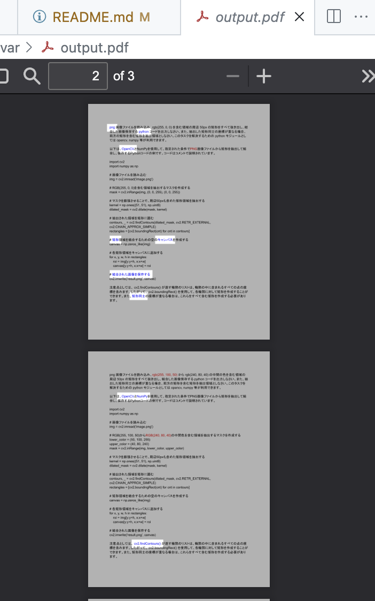

# pdfish

PDF ファイル中から指定した色を検出してハイライトし、ハイライトされたページだけを再結合した PDF を生成するツール。



# ユースケース

過去との差分を色で表現している PDF 文書から差分をわかりやすく抽出する。

# セットアップ (Mac)

[pdf2image](https://pypi.org/project/pdf2image/) を使うために必要なので [poppler](https://poppler.freedesktop.org/) をインストール
```sh
brew install poppler
```

python の依存関係をインストール ([venv](https://docs.python.org/3/library/venv.html) 推奨)
```sh
pip install -r requirements.txt
```

# メモ

- [GitHub Codespaces](https://github.com/features/codespaces) 上で開発を行ってみる、という事を目的の一つとする。
- コードの大半は [ChatGPT](https://openai.com/blog/chatgpt) と [GitHub Copilot](https://github.com/features/copilot) を元にしている。プロンプトは [document.pdf](./resources/document.pdf) に一部記載。